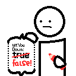

# Boring Default Game Rules

A mod that allows for changing the default game rule values. Meant to be used by modpacks, servers and players, because it's useful for everyone! This mod depends on the [Quilt Standard Libraries](https://modrinth.com/mod/qsl).

## Download

This mod is available for download on the following services:

- [Modrinth (recommended)](https://modrinth.com/mod/boring-default-game-rules)
- [CurseForge](https://www.curseforge.com/minecraft/mc-mods/boring-default-game-rules)
- [GitHub Releases (alternative)](https://github.com/EnnuiL/BoringDefaultGameRules/releases)

## Usage

The config file is located at `.minecraft/config/boringdefaultgamerules.json` and is currently the only way of configuring this mod. Despite that, we attempted to make the configuration process very painless for people who aren't used to manually doing the configuration.

One of the methods of making it easier is by automatically generation a JSON schema and linking the config file to it. [JSON Schemas](https://json-schema.org/) allows for validating and providing extra information for specific JSON files, and in order to make configuration easier, it contains all the game rules, their possible values and their original defaults, so you can easily define your own new defaults! The JSON Schema is read by [these editors](https://json-schema.org/implementations.html#editors), with [Visual Studio Code](https://code.visualstudio.com/) being our recommended editor.

Another is that if you have [Mod Menu](https://modrinth.com/mod/modmenu) installed, you can click the config button in order to reload the settings in-game, so you don't have to close the game at all!

Below here is the commented format (if you are offline, the JSON Schema also contains information about the options):

```jsonc
{
    // The file path of this mod's JSON schema. It's automatically defined by this mod and is only used by the text editor, so don't worry about this
    "$schema": "file:///path/to/.minecraft/config/schema/boringdefaultgamerules.schema.json",
    // A map of game rules and the new default value that will override the original
    "default_game_rules": {
        // This will set "keepInventory" to true as the default value
        // Autocompletions are provided by the JSON schema, so don't worry about having to memorize the game rule options
        "keepInventory": true
    },
    // Defines if a JSON schema should be generated or not. Only disable this if you know what you are doing
    "generate_json_schema": true
}
```

## License

This mod is licensed under the MIT license. You can freely include the mod on any modpack with no permission. Usage of this mod's code on other projects or derivatives of this mod is allowed as long as attribution is given.
