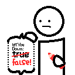

# Boring Default Game Rules

A mod that allows for changing the default game rule values. Meant to be used by modpacks, servers and players, because it's useful for everyone!

This mod depends on the [Quilt Standard Libraries](https://modrinth.com/mod/qsl).

## Download

This mod is available for download on the following services:

- [Modrinth (recommended)](https://modrinth.com/mod/boring-default-game-rules)
- [CurseForge](https://www.curseforge.com/minecraft/mc-mods/boring-default-game-rules)
- [GitHub Releases (alternative)](https://github.com/EnnuiL/BoringDefaultGameRules/releases)

## Usage

With this mod, there are two main methods in which you can edit the default game rules.

The main way to edit the defaults is through the "Edit Default Game Rules" screen, which can be accessed either through a button at the bottom of Vanilla's "Game Rules" screen or through the mod's config button on [Mod Menu](https://modrinth.com/mod/modmenu). On this screen, you can change the defaults like you would change the game rule values on a regular world, with a "Reset to Default" button being available at the bottom of the list if needed.

However, If you aren't in-game and have at least started it once, don't worry! There is a config file is located at `.minecraft/config/boring_default_game_rules/config.json`, and if you have a [JSON Schema-compatible editor](https://json-schema.org/implementations.html#editors) ([Visual Studio Code](https://code.visualstudio.com/) is recommended if you have none), it will make usage of the automatically-generated [JSON Schema](https://json-schema.org/) in order to enhance your editing experience! The generated JSON Schema contains not only documentation on the config itself, but also provides suggestions for all game rules detected on the game.

Below here is the commented format (if you are offline, the JSON Schema also contains information about the options):

```jsonc
{
    // The file path of this mod's JSON schema. It's automatically defined by this mod and is only used by the text editor, so don't worry about this
    // If needed, the path can be regenerated by using "GENERATE_ME" as its value
    "$schema": "file:///path/to/.minecraft/config/boring_default_game_rules/config.schema.json",
    // A map of game rules and the new default value that will override the original
    "default_game_rules": {
        // This will set "keepInventory" to true as the default value
        // Autocompletions are provided by the JSON schema, so don't worry about having to memorize the game rule options
        "keepInventory": true
    },
    // Defines if a JSON schema should be generated or not. Only disable this if you know what you are doing
    "generate_json_schema": true
}
```

## License

This mod is licensed under the MIT license. You can freely include the mod on any modpack with no permission. Usage of this mod's code on other projects or derivatives of this mod is allowed as long as attribution is given.
